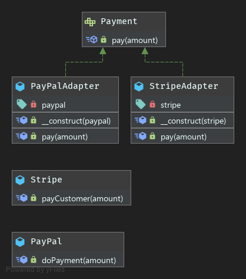

# Adapter Pattern

**Definition**
```
The Adapter pattern makes two incompatible objects work together without changing their interfaces.
```

***Why use adapter pattern?***
- The decorator pattern leverage SRP and OCP principles.
- Easy to implement
- Leverage object composition
- Do not break existing interfaces
- Ideal to maintain BC layers
- Ideal to isolate legacy code

***Drawback***
Due to set of new interfaces and classes the overall complexity of the code increases.

### UML

